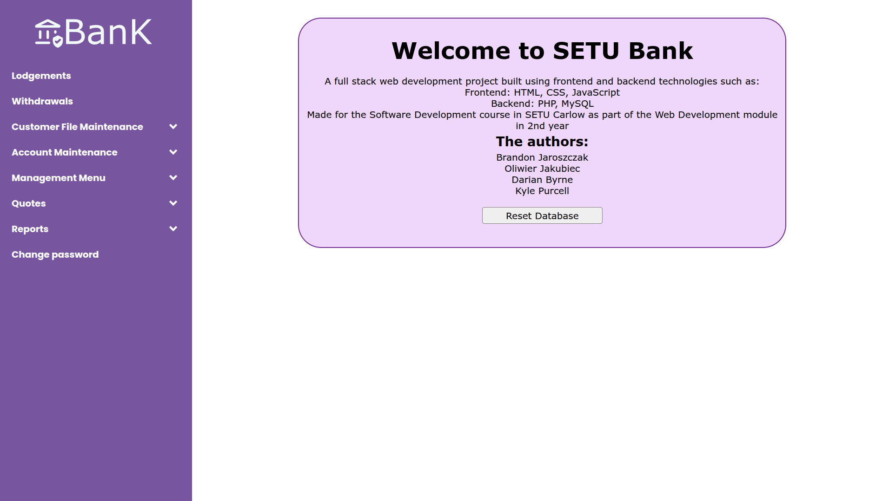
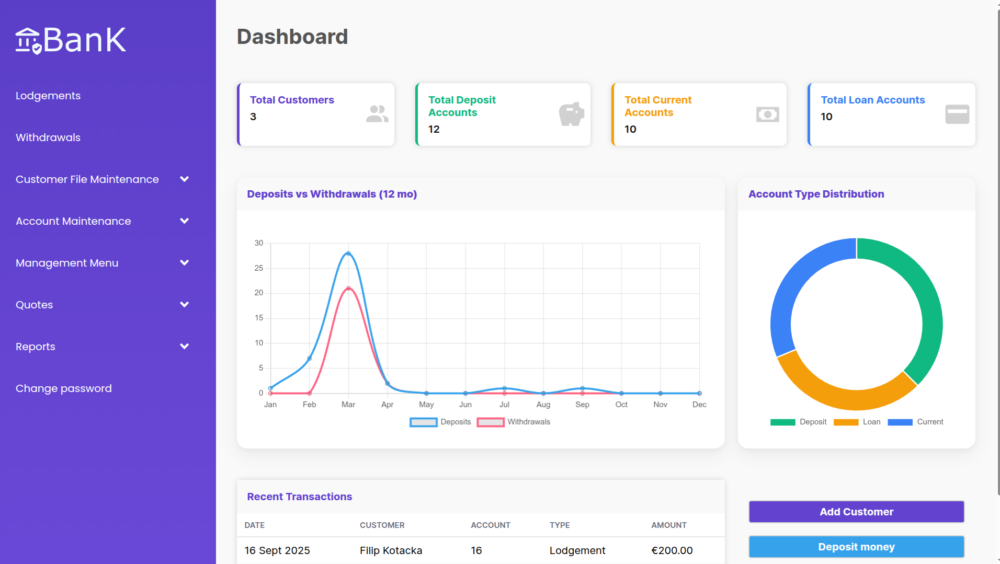
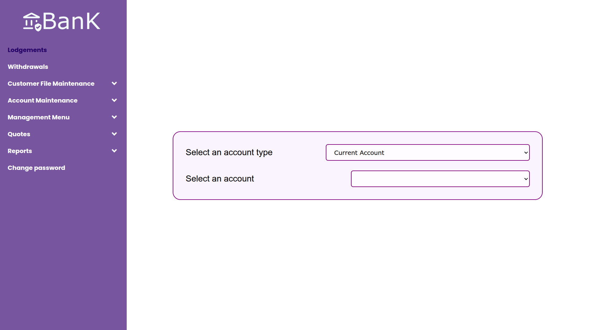
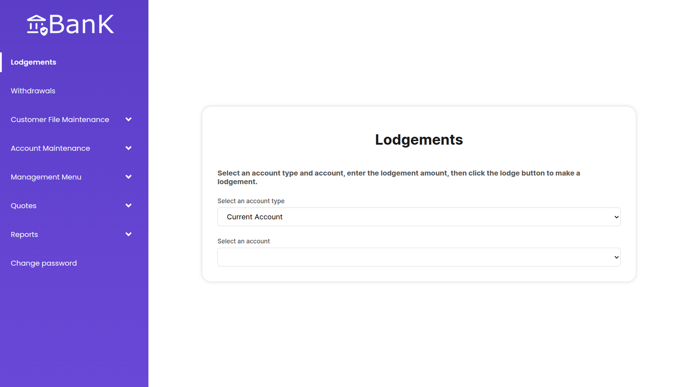
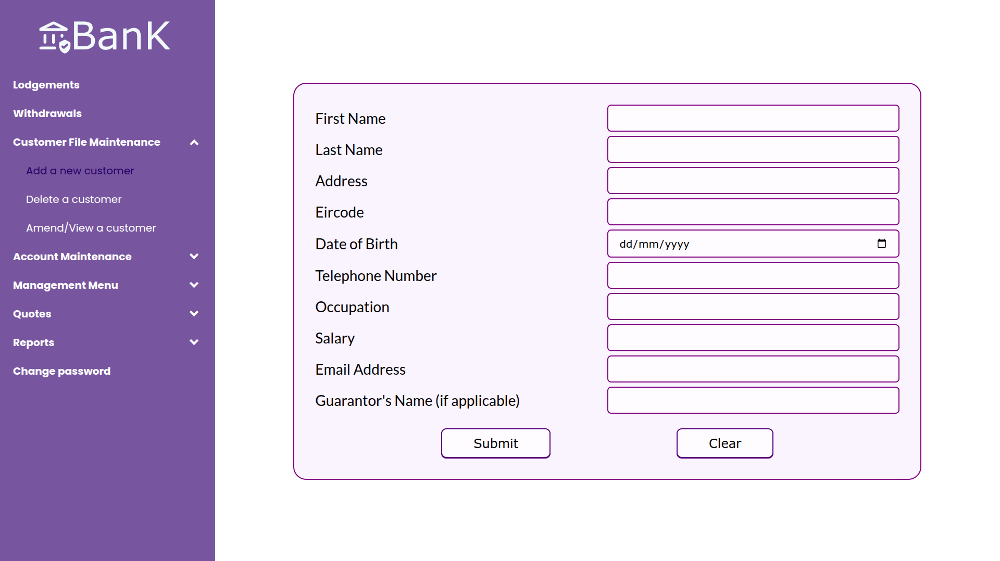
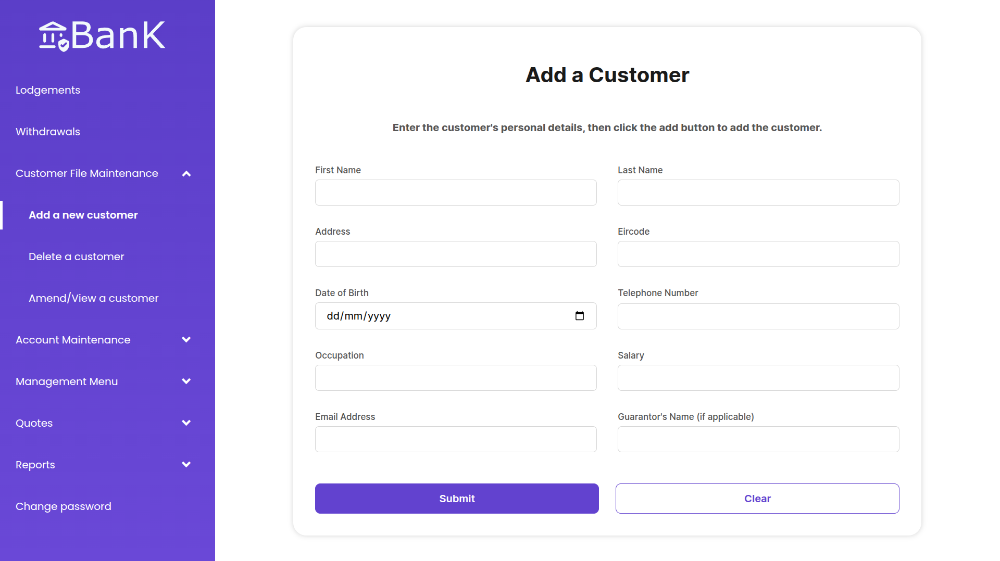

# Banking System

A collaborative PHP and MySQL project built during my second year at **SETU Carlow**. The system simulates a simple online banking platform that connects to a MySQL database, enabling users to perform CRUD operations.

## Technologies Used
- **Frontend:** HTML5, CSS3, JavaScript
- **Backend:** PHP 
- **Database:** MySQL
- **Version Control:** Git/GitHub

## My Contributions
This was a team project. My main contributions included:
- Forked the repository and redesigned the screens for a cleaner and more user-friendly experience.
- Improved navigation, consistency of layout, and visual styling.
- Collaborated with teammates on GitHub using branches and pull requests.
- Built and designed the lodgements and add, delete, and amend/view a customer screens.
- Added a dashboard screen with statistics about the system, such as total accounts and recent transactions.

## Screenshots

[Live Demo](https://bankingsystem-production-6046.up.railway.app/) *(UI-only preview; backend may not be fully functional)*
